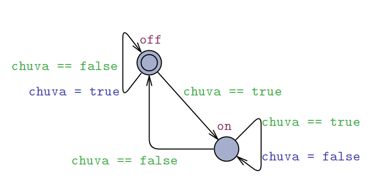

# WEIT 2023: Minicurso de Model Checking na Verificação Formal de Sistemas Autônomos

Este repositório apresenta a utilização de Model Checking na Verificação Formal de Sistemas Autônomos. Conteúdo do curso ministrado no WEIT'23 (VII Workshop-Escola de Informática Teórica).

Título: Utilização de Model Checking na verificação formal de sistemas autônomos

Descrição: Neste minicurso será apresentado um modelo formal que representa um sistema autônomo simples. Tal modelo será construído na ferramenta de model checking UPPALL, onde é possível simular o modelo e também executar verificações formais usando lógica temporal. O minicurso tem o seguinte programa:

1. Guia de Instalação do UPPAAL

2. Visão geral de autômato temporal e lógica temporal.

3. Utilização da ferramenta de model checking UPPALL.

4. Exemplos com representação de veículos autônomos em cenários de trânsito urbano com o UPPAAL.

5. Verificação formal de propriedades temporais.

---------------------------------------------------------------------

## Guia de Instalação do UPPAAL

1. Acessar o [link da ferramenta UPPAAL](https://uppaal.org/downloads/)

2. Faça o [registro](https://uppaal.veriaal.dk/academic.html) para obter uma licença acadêmica do UPPAAL.

3. Tendo feito o registro será enviado via e-mail (registrado) as informações da licensa acadêmica obtida.

4. Fazer o download da respectiva distribuição do UPPAAL da versão **5.0**:
* [Linux](https://download.uppaal.org/uppaal-5.0/uppaal-5.0.0/uppaal-5.0.0-linux64.zip)
* [Windows](https://download.uppaal.org/uppaal-5.0/uppaal-5.0.0/uppaal-5.0.0-win64.zip)
* [Mac](https://download.uppaal.org/uppaal-5.0/uppaal-5.0.0/UPPAAL-5.0.0-app.zip)

5. Fazer a respectiva instalação conforme a distribuição escolhida.

6. Mas, antes é necessário acessar o site oficial do UPPAAL e verificar as instruções complementares de instalação.

- no caso em relação à instalação do Java que é necessária para executar a interface gráfica da ferramenta.
- é necessário ter uma versão **Java >= 11**.
- veja tais [instruções complementares no site do UPPAAL](https://uppaal.org/downloads/) para proceder com a instalação do java (caso necessário).

7. O passo seguinte é simplesmente executar diretamente o arquivo do UPPAAL: 
- `uppaal.jar`
- ou `uppaal.exe`
- ou `uppaal`
* apenas, lembre-se que deve ter permissão para executar arquivos no diretório onde os arquivos do UPPAAL foram descompactados.

8. Executando com sucesso o programa. Na primeira vez, irá aparecer a janela gráfica do UPPAAL para ingressar a chave da licença, que foi recebida via e-mail.
* basta informar a chave e o acesso ao programa será imediatamente liberado.

9. Ainda é possível criar um atalho no computador, para facilmente abrir o UPPAAL nas próximas vezes. Para isso:
* No Linux, apenas executar o arquivo de script `AddLinks.sh` (que está disponível no mesmo diretório com demais arquivos do UPPAAL)
* No Windows, apenas executar o script `AddLinks.vbs`

10. Pronto! Agora a ferramenta está devidamente instalada. Para fazer um teste rápido.
* Abra a ferramenta.
* Selecione `File`
* Depois `Open Example`
* Escolha um exemplo como `Interrupt`, com isso o modelo com os autômatos temporais será aberto na aba `Editor`.


---------------------------------------------------------------------

## Conceitos básicos

#### Autômato temporal e Lógica temporal

Consultar material de apoio.

---------------------------------------------------------------------

## Utilização básica do UPPALL

Consultar material de apoio.

---------------------------------------------------------------------


## Exemplos com representação de veículos autônomos em cenários de trânsito urbano com o UPPAAL

### 1. Sensor de chuva

O primeiro exemplo apresenta um sistema bastante simples para acionar um limpador de parábrisa (quando está chovendo) de um carro .
Esse exemplo utiliza apenas um único modelo (autômato) com uso simples de variáveis booleanas. Veja o modelo do sistema na figura abaixo.

.

Definição das variáveis e declarações do sistema.

```java
bool chuva = false;

...

// Place template instantiations here.
sensorCarro1 = sensorchuva();
// List one or more processes to be composed into a system.
system sensorCarro1;
```

Código do modelo disponível em .

### 2. Único autômato (veículo)

Neste segundo exemplo é iustrado um cenário com um VA (Veículo Autônomo) aproximando-se de um cruzamento urbano. O cruzamento pode estar *livre* ou *ocupado*. São usadas apenas variáveis booleanas e um contador (variável) para controlar o acesso do veículo. Veja o modelo do sistema na figura abaixo.

.

Definição das variáveis e declarações do sistema.

```java
bool nocruzamento = false;
bool livre = true;
int aguardar= 0;

...

// Place template instantiations here.
carro1 = VA();
// List one or more processes to be composed into a system.
system carro1;
```

Código do modelo disponível em .

### 3. Veículo e Controlador (canais)

No terceiro exemplo há uma rede de autômatos com dois modelos: um veículo autônomo e um controlar do cruzamento. Então, neste modelo utilizams-se os canais de sincronização para habilitar a comunicação entre os autômatos. O VA deve avisar ao cruzamento quando está *próximo*, por sua vez o cruzamento deve informar ao VA se o cruzamento está *livre* ou *ocupado*. Veja o modelo do sistema na figura abaixo.

.

Definição das variáveis e declarações do sistema.

```java
int aguardar = 0;
chan proximo, livre, ocupado, longe;

...

// Place template instantiations here.
carro = VA();
cruzamento = Controle();
// List one or more processes to be composed into a system.
system carro, cruzamento;
```

Código do modelo disponível em .

### 4. Veículo e Controlador (clocks e diversas instâncias) 

Esse exemplo é uma extensão do anterior. Agora, além dos canais são usados clocks para estabelecer uma restrição temporal do tempo para que o VA verifique novamente o cruzamento quando está ocupado. Veja o modelo do sistema nas figuras abaixo.

 e .

Definição dos canais, variáveis e declarações do sistema.

```java
chan proximo, livre, ocupado, longe;

...

clock aguardar = 0;

...

// Place template instantiations here.
carro1 = VA();
carro2 = VA();
carro3 = VA();
carro4 = VA();
cruzamento = Controle();
// List one or more processes to be composed into a system.
// system carro1, cruzamento;
system carro1, carro2, carro3, carro4, cruzamento;
```

Código do modelo disponível em .

### 5. Exercícios:

#### 5.1 Sensor de chuva com canais e clock

DESC...

#### 5.2 Veículo e placa de pare

DESC...

### 6. Veículo, place de pare e pedestre

DESC.... 
Veja a definição da restrição temporal do modelo na figura abaixo.

.

Veja o modelo do sistema nas figuras abaixo.

.

.


Definição dos canais, variáveis e declarações do sistema.

```java
bool chuva = false;

...

// Place template instantiations here.
sensorCarro1 = sensorchuva();
// List one or more processes to be composed into a system.
system sensorCarro1;
```

Código do modelo disponível em .

---------------------------------------------------------------------
    
## Verificação formal de propriedades

```javascript
import Component from 'my-project'

function App() {
  return <Component />
}
```

---------------------------------------------------------------------

## Informações complementares

- Curso elaborado pelo professor Gleifer Vaz Alves (UTFPR - Campus Ponta Grossa)
- e-mail: gleifer@utfpr.edu.br
- [Site com maiores Informações de pesquisa](https://sites.google.com/view/gleifer)
- Site do lab. de pesquisa [LaCA-IS](https://laca-is.github.io/)

---------------------------------------------------------------------
---------------------------------------------------------------------
